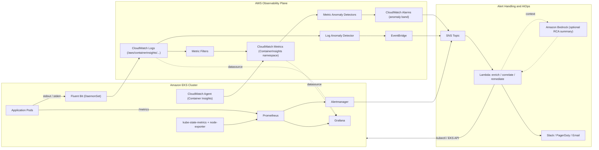
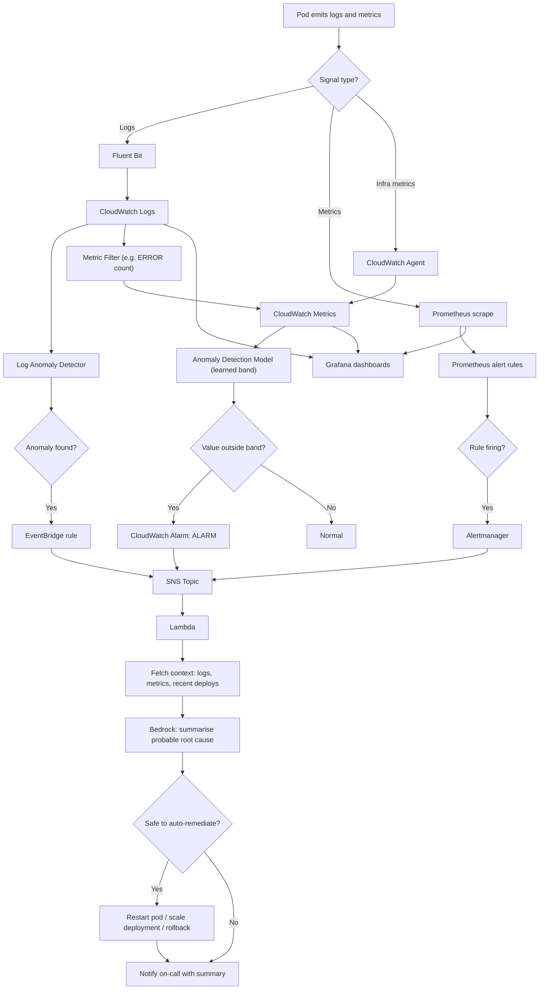

# AIOps on EKS: Prometheus, Grafana & CloudWatch Anomaly Detection

An AIOps reference setup for Amazon EKS that combines:

- **Prometheus + Grafana** for real-time metrics, dashboards and rule-based alerts
- **CloudWatch Logs + Container Insights** for log and metric collection
- **CloudWatch Anomaly Detection** (metric and log) for ML-based, baseline-driven alerting
- **SNS + Lambda (+ optional Amazon Bedrock)** to enrich alerts, summarise probable root cause and notify or auto-remediate

---

## 1. Architecture



### Component summary

| Layer | Component | Purpose |
|---|---|---|
| Collection | Fluent Bit (DaemonSet) | Ships container logs to CloudWatch Logs |
| Collection | CloudWatch Agent | Publishes Container Insights metrics (CPU, memory, restarts, network) |
| Collection | Prometheus, kube-state-metrics, node-exporter | Scrapes cluster and app metrics |
| Visualisation | Grafana | Single pane of glass with Prometheus and CloudWatch data sources |
| Detection (rules) | Prometheus rules + Alertmanager | Deterministic alerts (known thresholds, SLOs) |
| Detection (ML) | CloudWatch Metric Anomaly Detection | Learns seasonal baselines and alarms on deviations |
| Detection (ML) | CloudWatch Logs Anomaly Detection | Finds unusual log patterns and spikes automatically |
| Routing | SNS, EventBridge | Fan-in of all alert sources |
| Response | Lambda (+ Bedrock optional) | Enrichment, RCA summary, notification, safe auto-remediation |

---

## 2. Data & Alert Flow



---

## 3. Prerequisites

- AWS account, AWS CLI v2, `kubectl`, `helm`, `eksctl` (or Terraform)
- An EKS cluster with an **OIDC provider** (IRSA) or **EKS Pod Identity** enabled
- Permissions to create IAM roles, SNS, Lambda, CloudWatch alarms/detectors

```bash
export AWS_REGION=ap-south-1
export CLUSTER=aiops-eks
export ACCOUNT_ID=$(aws sts get-caller-identity --query Account --output text)
```

---

## 4. Setup

### Step 1: Create the EKS cluster (skip if you have one)

```bash
eksctl create cluster \
  --name $CLUSTER --region $AWS_REGION \
  --version 1.31 \
  --nodegroup-name ng-1 --node-type m5.large --nodes 3 \
  --with-oidc
```

> Use a currently supported EKS version in your region.

### Step 2: Logs and Container Insights to CloudWatch

The `amazon-cloudwatch-observability` add-on installs the CloudWatch Agent **and** Fluent Bit.

```bash
eksctl create iamserviceaccount \
  --name cloudwatch-agent --namespace amazon-cloudwatch \
  --cluster $CLUSTER --region $AWS_REGION \
  --role-name ${CLUSTER}-cw-agent-role \
  --attach-policy-arn arn:aws:iam::aws:policy/CloudWatchAgentServerPolicy \
  --role-only --approve

aws eks create-addon \
  --cluster-name $CLUSTER --region $AWS_REGION \
  --addon-name amazon-cloudwatch-observability \
  --service-account-role-arn arn:aws:iam::$ACCOUNT_ID:role/${CLUSTER}-cw-agent-role
```

Resulting log groups:

```
/aws/containerinsights/<cluster>/application
/aws/containerinsights/<cluster>/dataplane
/aws/containerinsights/<cluster>/host
/aws/containerinsights/<cluster>/performance
```

### Step 3: Prometheus and Grafana

```bash
helm repo add prometheus-community https://prometheus-community.github.io/helm-charts
helm repo update

helm upgrade --install monitoring prometheus-community/kube-prometheus-stack \
  -n monitoring --create namespace \
  -f k8s/prometheus-values.yaml
```

`k8s/prometheus-values.yaml` (minimal example):

```yaml
prometheus:
  prometheusSpec:
    retention: 15d
    storageSpec:
      volumeClaimTemplate:
        spec:
          storageClassName: gp3
          resources:
            requests:
              storage: 50Gi

alertmanager:
  config:
    route:
      receiver: sns
      group_by: [alertname, namespace]
    receivers:
      - name: sns
        sns_configs:
          - topic_arn: arn:aws:sns:ap-south-1:<ACCOUNT_ID>:aiops-alerts
            sigv4:
              region: ap-south-1

grafana:
  serviceAccount:
    create: true
    name: grafana
    annotations:
      eks.amazonaws.com/role-arn: arn:aws:iam::<ACCOUNT_ID>:role/grafana-cloudwatch-read
  additionalDataSources:
    - name: CloudWatch
      type: cloudwatch
      jsonData:
        defaultRegion: ap-south-1
        authType: default
```

> Alertmanager's SNS receiver needs an IAM role (IRSA) with `sns:Publish` on the topic.
> Attach `CloudWatchReadOnlyAccess` (or a scoped policy) to the `grafana-cloudwatch-read` role.

For a managed alternative, use **Amazon Managed Service for Prometheus** and **Amazon Managed Grafana**.

### Step 4: SNS topic for alerts

```bash
aws sns create-topic --name aiops-alerts --region $AWS_REGION
aws sns subscribe --topic-arn arn:aws:sns:$AWS_REGION:$ACCOUNT_ID:aiops-alerts \
  --protocol email --notification-endpoint you@example.com
```

### Step 5: CloudWatch metric anomaly detection

Create a detector for pod CPU, then an alarm that uses the learned band:

```bash
aws cloudwatch put-anomaly-detector --region $AWS_REGION \
  --single-metric-anomaly-detector '{
    "Namespace": "ContainerInsights",
    "MetricName": "pod_cpu_utilization",
    "Stat": "Average",
    "Dimensions": [
      {"Name": "ClusterName", "Value": "'$CLUSTER'"},
      {"Name": "Namespace",   "Value": "default"}
    ]
  }'

aws cloudwatch put-metric-alarm --region $AWS_REGION \
  --alarm-name "${CLUSTER}-pod-cpu-anomaly" \
  --comparison-operator GreaterThanUpperThreshold \
  --evaluation-periods 3 --datapoints-to-alarm 2 \
  --threshold-metric-id ad1 \
  --treat-missing-data notBreaching \
  --alarm-actions arn:aws:sns:$AWS_REGION:$ACCOUNT_ID:aiops-alerts \
  --metrics '[
    {"Id":"m1","ReturnData":true,"MetricStat":{"Metric":{"Namespace":"ContainerInsights","MetricName":"pod_cpu_utilization","Dimensions":[{"Name":"ClusterName","Value":"'$CLUSTER'"},{"Name":"Namespace","Value":"default"}]},"Period":300,"Stat":"Average"}},
    {"Id":"ad1","Expression":"ANOMALY_DETECTION_BAND(m1, 2)","Label":"CPU (expected band)","ReturnData":true}
  ]'
```

Recommended metrics to cover: `pod_cpu_utilization`, `pod_memory_utilization`, `pod_number_of_container_restarts`, `node_cpu_utilization`, `pod_network_rx_bytes`, plus any custom metric created from log filters (e.g. 5xx or `ERROR` counts).

### Step 6: CloudWatch logs anomaly detection

```bash
aws logs create-log-anomaly-detector --region $AWS_REGION \
  --log-group-arn-list arn:aws:logs:$AWS_REGION:$ACCOUNT_ID:log-group:/aws/containerinsights/$CLUSTER/application \
  --detector-name ${CLUSTER}-app-logs \
  --evaluation-frequency FIFTEEN_MIN \
  --anomaly-visibility-time 7
```

Route detected anomalies to SNS with EventBridge. Check the event schema in your account and refine the pattern, since the detail type can vary.

```bash
aws events put-rule --region $AWS_REGION --name logs-anomaly-rule \
  --event-pattern '{"source":["aws.logs"],"detail-type":[{"prefix":"CloudWatch Logs Anomaly"}]}'

aws events put-targets --region $AWS_REGION --rule logs-anomaly-rule \
  --targets "Id"="sns","Arn"="arn:aws:sns:$AWS_REGION:$ACCOUNT_ID:aiops-alerts"
```

Also create a metric filter to turn error logs into a metric that can have its own anomaly detector:

```bash
aws logs put-metric-filter --region $AWS_REGION \
  --log-group-name /aws/containerinsights/$CLUSTER/application \
  --filter-name error-count \
  --filter-pattern '?ERROR ?Exception ?"level=error"' \
  --metric-transformations metricName=AppErrorCount,metricNamespace=AIOps,metricValue=1
```

### Step 7: Lambda for enrichment, RCA and remediation

Subscribe a Lambda to the SNS topic. Suggested logic:

1. Parse the alarm, EventBridge or Alertmanager payload and normalise it.
2. Pull context: last 15 minutes of error logs (CloudWatch Logs Insights), related metrics, recent deployments.
3. *(Optional)* Send the context to Amazon Bedrock to produce a short probable-root-cause summary.
4. If the alert matches an allow-listed pattern (e.g. `CrashLoopBackOff` on a stateless deployment), run a safe action such as `rollout restart`.
5. Post the summary and action taken to Slack or PagerDuty.

Skeleton:

```python
import json, boto3

logs = boto3.client("logs")
bedrock = boto3.client("bedrock-runtime")

def handler(event, context):
    for record in event["Records"]:
        alert = json.loads(record["Sns"]["Message"])
        # 1. normalise -> 2. fetch logs via logs.start_query(...)
        # 3. summarise via bedrock.converse(...)
        # 4. optional remediation (allow-list only)
        # 5. notify Slack / PagerDuty
    return {"status": "ok"}
```

> Keep remediation **opt-in and allow-listed**. Start in notify-only mode and enable actions per alert type once trusted.

### Step 8: Grafana dashboards

- Import dashboards **15757** (K8s views/global) and **1860** (Node Exporter Full), or use those bundled with kube-prometheus-stack.
- Add CloudWatch panels using the `CloudWatch` data source: Container Insights metrics, alarm states, and Logs Insights queries.
- Overlay the anomaly band by plotting the `ANOMALY_DETECTION_BAND` expression on the metric panel.

---

## 5. Suggested Repository Layout

```
.
├── README.md
├── terraform/              # EKS, IAM (IRSA), SNS, alarms, detectors, Lambda
├── k8s/
│   ├── prometheus-values.yaml
│   └── rules/              # PrometheusRule CRDs
├── lambda/
│   └── alert_handler/      # enrichment, RCA, remediation
├── grafana/
│   └── dashboards/         # exported JSON
└── scripts/
    └── bootstrap.sh
```

---

## 6. Prometheus Alert Rule Example

```yaml
apiVersion: monitoring.coreos.com/v1
kind: PrometheusRule
metadata:
  name: aiops-basic-rules
  namespace: monitoring
  labels:
    release: monitoring
spec:
  groups:
    - name: pod-health
      rules:
        - alert: PodCrashLooping
          expr: increase(kube_pod_container_status_restarts_total[15m]) > 3
          for: 5m
          labels: { severity: critical }
          annotations:
            summary: "{{ $labels.namespace }}/{{ $labels.pod }} is restarting repeatedly"
        - alert: HighPodMemory
          expr: container_memory_working_set_bytes / container_spec_memory_limit_bytes > 0.9
          for: 10m
          labels: { severity: warning }
```

---

## 7. When to use which detector

| Scenario | Use |
|---|---|
| Known hard limit (disk > 90%, pod restarts > 3) | Prometheus rule |
| Metric with daily/weekly seasonality (traffic, CPU) | CloudWatch metric anomaly detection |
| Unknown or new error patterns in logs | CloudWatch Logs anomaly detection |
| SLO / burn-rate alerting | Prometheus recording rules + Alertmanager |

---

## 8. Cost & Operations Notes

- Anomaly detection models need roughly **2 weeks** of data to learn seasonality well; expect noise early on and tune the band width (the `2` in `ANOMALY_DETECTION_BAND(m1, 2)`).
- Anomaly detectors and Container Insights are billed per metric/alarm; scope them to key namespaces rather than the entire cluster.
- Set log group retention (e.g. 14-30 days) to control CloudWatch Logs cost.
- Use gp3 volumes and a retention limit for Prometheus, or move to Amazon Managed Prometheus for long-term storage.
- Check the current AWS pricing page for your region before rollout.

## 9. Cleanup

```bash
aws cloudwatch delete-alarms --alarm-names ${CLUSTER}-pod-cpu-anomaly --region $AWS_REGION
aws logs delete-log-anomaly-detector --anomaly-detector-arn <arn> --region $AWS_REGION
helm uninstall monitoring -n monitoring
aws eks delete-addon --cluster-name $CLUSTER --addon-name amazon-cloudwatch-observability --region $AWS_REGION
eksctl delete cluster --name $CLUSTER --region $AWS_REGION
```
